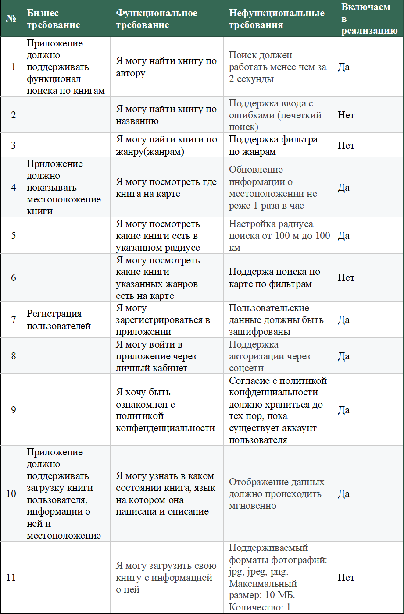
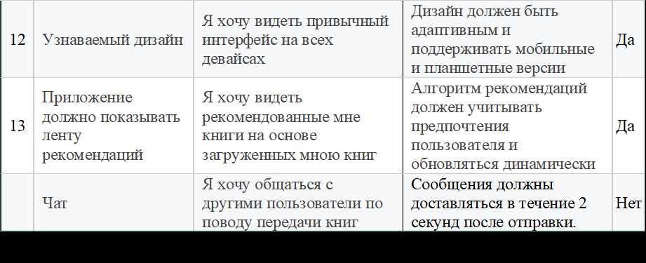
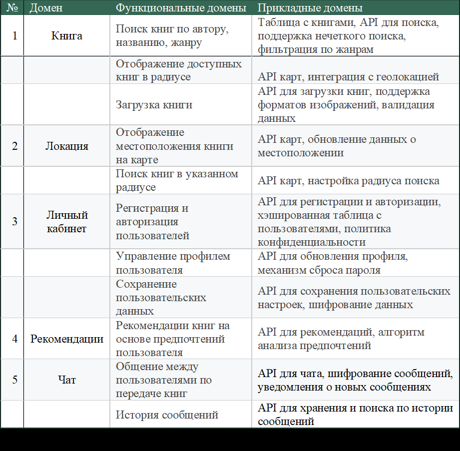
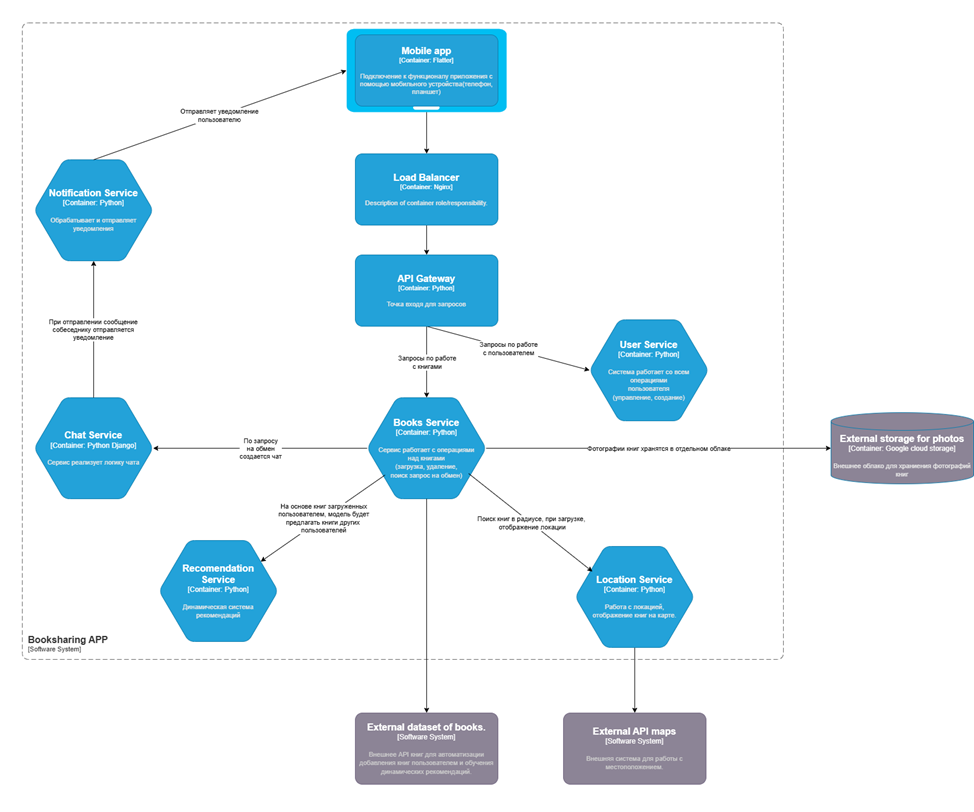
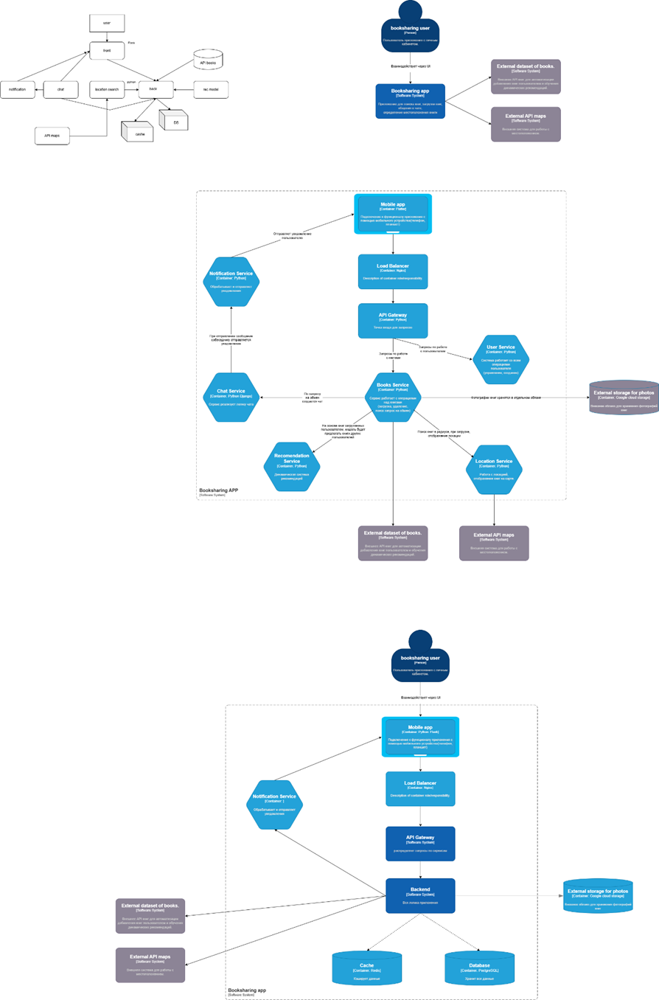
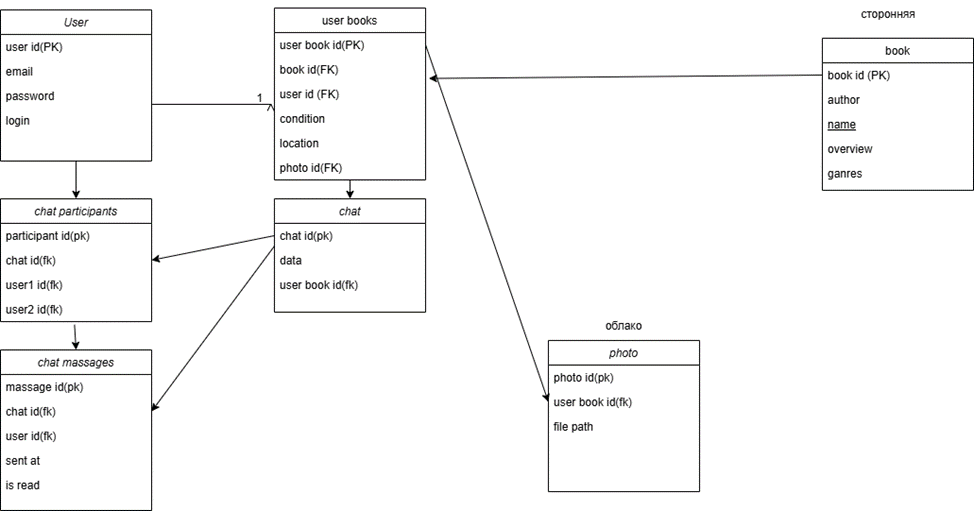

# Gnezdo

**Участники**:
- Стародубцева К.А. 5130904/20103
- Халикова М.И. 5130904/20103
- Арбаева А.Ф. 5130904/20103
- Трегубова М.С. 5130904/20103

## Определение проблемы
В современном обществе, несмотря на рост интереса к чтению, пользователи сталкиваются с проблемой ограниченного доступа к книгам, особенно в небольших городах или удалённых районах. Отсутствие удобных инструментов для обмена книгами между читателями приводит к сложностям в поиске желаемой литературы, а также к невозможности эффективно делиться своими книгами с другими. Это ограничивает доступ к разнообразию литературы и затрудняет формирование сообществ читателей, которые могли бы обмениваться книгами и опытом.
## Выработка требований
### Снятие и анализ бизнес-требований с заказчика
На основе собранных и проанализированных бизнес-требований Заказчика были подготовлены функциональные и нефункциональные требования, которые отражены в представленной далее таблице, и зафиксирован итоговый перечень требований, подлежащих реализации.


### Выделение функциональных и прикладных доменов
При разработке структуры нашего проекта мы следовали подходу, основанному на выделении функциональных доменов (ключевых бизнес функций) и последующей их детализации на прикладные домены (технические зоны ответственности). Этот анализ позволил определить потенциальные компоненты системы, которые представлены в следующей таблице.

## Разработка архитектуры и детальное проектирование
Для всестороннего описания проектируемой системы было разработано множество визуальных моделей. Чтобы сфокусировать внимание на наиболее важных аспектах, в данном отчете мы приводим ключевые диаграммы: C4, отражающую архитектурные уровни, Abstract High-level design, показывающую общую структуру, и ERD, детализирующую модель данных.
### C4

### Absract High-level design

### ERD

## Кодирование и отладка 
### Использованные технологии
- FastAPI: Основной фреймворк для API Gateway и Recommendation Service, обеспечивающий асинхронную маршрутизацию и высокую производительность. Использованы зависимости (Depends), middleware (CORS) и обработка форм (UploadFile).
- Django и Django REST Framework (DRF): Использованы для User Management и Book Service. Django обеспечивает ORM для работы с PostgreSQL, а DRF предоставляет сериализаторы, представления и маршруты для REST API.
- PostgreSQL: Реляционная база данных для хранения данных пользователей, книг и запросов на обмен. Использованы индексы (indexes в моделях) для оптимизации запросов.
- Redis: Применён для кэширования в Book Service (django_redis) и Recommendation Service (redis.asyncio, redis), а также как брокер сообщений для Celery.
- Celery: Использован в Recommendation Service для асинхронных задач (например, compute_recommendations_task), что позволяет вычислять рекомендации в фоновом режиме.
- Cloudinary: Хранилище для фотографий пользователей и книг, интегрированное через cloudinary и cloudinary_storage в Django.
- Google Books API: Использован в Book Service для поиска книг и получения метаданных.
- scikit-learn: Применён в Recommendation Service для реализации алгоритмов рекомендаций (TfidfVectorizer, cosine_similarity).
- NumPy и Pandas: Использованы для работы с данными и матрицами в Recommendation Service.
- JWT (JSON Web Tokens): Применён для аутентификации через rest_framework_simplejwt (Django) и PyJWT (FastAPI).
- Docker: Использован для контейнеризации сервисов (API Gateway, Recommendation Service) и запуска Redis.
- Uvicorn: ASGI-сервер для запуска FastAPI-приложений.
- Requests и httpx: Для HTTP-запросов между сервисами (requests в Django, httpx в FastAPI).
- SMTP (Gmail): Для отправки писем при сбросе пароля в User Management.
- joblib: Для сохранения и загрузки матриц в Recommendation Service.
### Работа приложения 
В системе реализованы 4 микросервиса:
1.	[Book Management API (Django + DRF)](https://github.com/katyagolubb/Gnezdo-App/blob/main/book-api/README.md) – управление книгами, фотографиями, обменами.
2.	[Book Recommendation Service (FastAPI + Celery)](https://github.com/katyagolubb/Gnezdo-App/blob/main/recommendation-service/README.md) – рекомендации книг.
3.	[User Service (Django)](https://github.com/katyagolubb/Gnezdo-App/blob/main/user-management-api/README.md) – управление пользователями.
4.  Api Gateway 

## Setup
1. Clone the Repository
```bash
git clone <repository-url>
cd <repository-directory>
```
2. Build and Run Services
    Build and start all services:
    ```bash
    docker-compose up --build
    ```
    This command:
    - Builds Docker images for api_gateway, user-management-api, book-api, and recommendation-service based on their Dockerfile.
    - Starts containers for all services and Redis.
    Exposes ports:
    - 8000 for API Gateway
    - 5000 for Book API
    - 5001 for User Management API
    - 8002 for Recommendation Service
    - 6379 for Redis

    To run in detached mode:
    ```bash
    docker-compose up --build -d
    ```
3. Verify Setup
Check the API Gateway status:
```bash
curl http://localhost:8000/health
```
Expected response:
```json
{
  "status": "healthy",
  "services": ["user-management", "book", "recommendation"]
}
```
View service logs if needed:
```bash
docker-compose logs
```